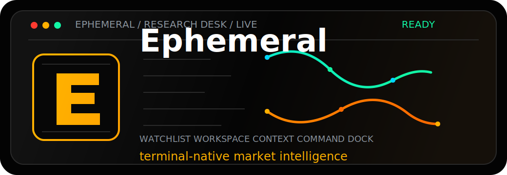
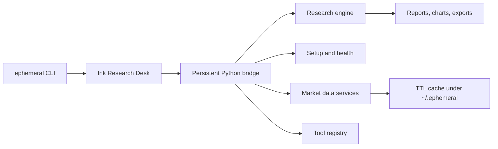

<div align="center">



# Ephemeral

### A terminal-native research desk for markets, models, and decision loops.

[](./ephemeral/version.py)
[](https://github.com/vadimdemedes/ink)
[](https://www.python.org/)
[](https://nodejs.org/)

Ephemeral turns a terminal into a professional research workstation: live symbol context, watchlists, news, backtests, model routing, setup health, artifacts, and a command dock that never gets out of the way.

</div>

---

## The Desk

```text
 EPHEMERAL RESEARCH DESK SPY v4.0.0                        LIVE · ready
 Research / Ask / Research · Ask · local ready              workspace ready
 ┌────────────────────┐ ┌────────────────────────────────────┐ ┌────────────────────┐
 │ WATCHLIST          │ │ ASK                     workspace  │ │ CONTEXT            │
 │ > SPY   621.40 +0.2│ │ Thesis, catalysts, risk, compare   │ │ SPY $621.40 +0.2%  │
 │   QQQ   548.90 +0.4│ │                                    │ │ SETUP              │
 │   DIA   443.10 -0.1│ │ /quote AAPL                        │ │ No blockers        │
 │                    │ │ /news NVDA                         │ │ NEWS               │
 │ RESEARCH           │ │ /compare AAPL MSFT                 │ │ Headlines loaded   │
 │ > Ask              │ │ /backtest AAPL -s sma_crossover    │ │ ARTIFACTS          │
 │   Quote            │ │                                    │ │ Reports, charts    │
 └────────────────────┘ └────────────────────────────────────┘ └────────────────────┘
 ┌───────────────────────────────────────────────────────────────────────────────────┐
 │ Ask                                                            READY · Enter to run│
 │ > What changed in NVDA's thesis after the latest guide?                           │
 └───────────────────────────────────────────────────────────────────────────────────┘
```

This is not a launcher. It is a shell for staying inside one research loop:

| Surface | What it does |
| :--- | :--- |
| Market chrome | Shows the active symbol, routing state, readiness, and current workflow. |
| Watchlist rail | Keeps indexes, active tickers, and workflows visible while you work. |
| Workspace | Renders the selected result, raw payloads, research output, or command response. |
| Context rail | Shows quote state, setup issues, related news, artifacts, and warnings. |
| Command dock | Runs natural-language requests and slash commands from anywhere. |

---

## Why It Exists

Most finance tools split attention across dashboards, notebooks, terminals, browser tabs, and chat windows. Ephemeral compresses that into one keyboard-first environment:

- Ask for thesis work, catalysts, and risk checks.
- Pull quotes, headlines, comparisons, charts, and backtests.
- Route through local or cloud LLM providers.
- Keep provider setup, local-model state, and dependency health visible.
- Export charts, reports, and session artifacts under `~/.ephemeral/`.

The result is fast enough for terminal work and structured enough for real research.

---

## Install

```bash
curl -fsSL https://raw.githubusercontent.com/desenyon/ephemeral/main/scripts/install.sh | bash
```

Pin a release:

```bash
curl -fsSL https://raw.githubusercontent.com/desenyon/ephemeral/main/scripts/install.sh | EPHEMERAL_REF=v4.0.0 bash
```

Requirements:

| Requirement | Why |
| :--- | :--- |
| Python `3.11+` | CLI, bridge, data services, model routing |
| Node.js + `npm` | Ink Research Desk frontend |
| `curl` + `tar` | One-line installer |

Launch:

```bash
ephemeral
```

If `~/.local/bin` is not on your `PATH`, run `~/.local/bin/ephemeral` directly or add that directory to your shell profile.

---

## Source Setup

```bash
git clone https://github.com/desenyon/ephemeral.git
cd ephemeral
uv sync --extra dev
npm install --prefix ephemeral/ink_ui
uv run ephemeral
```

Classic virtualenv flow:

```bash
python3 -m venv .venv
source .venv/bin/activate
pip install -r requirements.txt
npm install --prefix ephemeral/ink_ui
pip install -e ".[dev]"
ephemeral
```

---

## Command Map

### Research Desk

| Command | Result |
| :--- | :--- |
| `ephemeral` | Launch the default Ink Research Desk. |
| `ephemeral --legacy-ui` | Launch the legacy Textual interface. |
| `ephemeral --ink-ui` | Force Ink and fail instead of falling back. |

### One-shot workflows

| Command | Result |
| :--- | :--- |
| `ephemeral ask "What changed in AAPL's thesis?"` | Run a tool-aware LLM request. |
| `ephemeral quote AAPL MSFT NVDA` | Fetch quote snapshots. |
| `ephemeral news NVDA -n 12` | Produce a headline digest. |
| `ephemeral compare META GOOGL AMZN` | Compare returns, volatility, and quality metrics. |
| `ephemeral chart SPY --period 6mo` | Save a chart artifact. |
| `ephemeral backtest AAPL -s sma_crossover --period 2y` | Run the built-in backtest engine. |
| `ephemeral doctor` | Run dependency and environment checks. |
| `ephemeral tools` | List registered model tools. |

### Configuration

| Command | Result |
| :--- | :--- |
| `ephemeral --setup` | Run provider and local-model setup. |
| `ephemeral --status` | Show provider, model, key, and dependency health. |
| `ephemeral --list-models` | Print bundled model suggestions by provider. |
| `ephemeral --provider openai` | Persist a default provider. |
| `ephemeral --model gpt-5.4` | Persist a default model. |
| `ephemeral --setkey openai <key>` | Save an API key in `~/.ephemeral/config.env`. |

---

## Desk Shortcuts

| Key | Action |
| :--- | :--- |
| `Tab` | Cycle left rail, workspace, right rail, command dock. |
| `Left` / `Right` | Move between major panes when the dock is empty. |
| `Up` / `Down` or `j` / `k` | Move inside the focused pane or scroll output. |
| `/` | Start a slash command from any pane. |
| `[` / `]` | Page workspace output. |
| `d` | Toggle rendered/raw payload view. |
| `Esc` | Clear prompt and return focus to the command dock. |
| `Ctrl+C` | Quit. |

---

## Provider Setup

Cloud keys:

```bash
ephemeral --setkey openai <your-key>
ephemeral --setkey anthropic <your-key>
ephemeral --setkey google <your-key>
ephemeral --provider openai
ephemeral --model gpt-5.4
```

Local Ollama:

```bash
ollama serve
ollama pull qwen3.5:8b
ephemeral --provider ollama
ephemeral --model qwen3.5:8b
ephemeral --status
```

The Research Desk surfaces setup blockers in the context rail, so missing keys, unreachable Ollama, and unavailable local models are visible while you work.

---

## Architecture



| Layer | Responsibility |
| :--- | :--- |
| `ephemeral/ink_ui` | React + Ink Research Desk frontend. |
| `ephemeral/ink_bridge.py` | Structured process boundary between Ink and Python workflows. |
| `ephemeral/research/workspace.py` | Failure-tolerant workspace snapshots for desk panels. |
| `ephemeral/cli.py` | CLI entry point and launcher orchestration. |
| `ephemeral/setup_agent.py` | Provider, key, and local-model onboarding. |
| `ephemeral/llm` | Router and provider implementations. |
| `ephemeral/tools` | Model-callable research tools. |
| `ephemeral/backtest` | Built-in backtesting workflows. |

---

## Quality Gates

```bash
uv run --extra dev pytest -q
npm --prefix ephemeral/ink_ui run typecheck
npm --prefix ephemeral/ink_ui run smoke
uv run ruff check .
```

Current Research Desk branch verification:

| Gate | Status |
| :--- | :--- |
| Python tests | `1003 passed, 1 deselected` |
| Ink typecheck | passing |
| Ink smoke render | passing |
| Ruff | passing |

---

## Build

```bash
./scripts/build.sh
```

Build outputs:

- Python distributions under `dist/`
- macOS app bundle through `scripts/create_app.py`

---

## Project State

- Release notes: [CHANGELOG.md](./CHANGELOG.md)
- Version source: [ephemeral/version.py](./ephemeral/version.py)
- License: [LICENSE](./LICENSE)

Ephemeral is built for people who want the terminal to feel like a desk, not a prompt.
